```{r setup, include=FALSE}
usethis::use_git_ignore(c("*.csv", "*.rds"))
options(htmltools.dir.version = FALSE)

library(knitr)
library(tidyverse)
library(xaringan)
library(fontawesome)
library(cowplot)
library(igraph)
library(tidygraph)
library(ggraph)
library(ggthemes)
library(cowplot)
library(kableExtra)
```

class: inverse, center, middle

# `r fa("far fa-images", fill = "#fff")`

**View the slides:** 

[bretsw.com/eme6356-su25-module5](https://bretsw.com/eme6356-su25-module5)


---

class: inverse, center, middle

# `r fa("fas fa-comments", fill = "#fff")` <br><br> Looking Back at Module 4

---

# `r fa("fas fa-thumbs-up", fill = "#fff")` Optimism about analytics

```{r, out.width = "540px", echo = FALSE, fig.align = "center"}

```

--

**Use social media analytics to:**

--

- Keep up-to-date with what is happening in the learning community

--

- Understand trends

--

- Run experiments

---

# `r fa("fas fa-thumbs-down", fill = "#fff")` Pessimism About Analytics

```{r, out.width = "540px", echo = FALSE, fig.align = "center"}

```

--

**Problems with using social media analytics:**

--

- Understanding context beyond *digital traces*

--

- Capturing the complexity of human behavior and learning

--

- Raising all kinds of new ethical concerns (consent, spam, harassment)

---

class: inverse, center, middle

# `r fa("fas fa-question", fill = "#fff")` <br><br> Module 4 <br> Final Thoughts?


---

class: inverse, center, middle

# `r fa("fas fa-chart-line", fill = "#fff")` <br><br> Module 5: <br> Data Visualization

---

class: inverse, center, middle

# `r fa("fas fa-chart-line", fill = "#fff")` <br><br> **Defining Analytics**

**Measure `r fa("fas fa-arrow-right", fill = "#fff")` Collect `r fa("fas fa-arrow-right", fill = "#fff")` Analyze `r fa("fas fa-arrow-right", fill = "#fff")` Report**

---

# `r fa("fas fa-chart-line", fill = "#fff")` Data Visualization

```{r, out.width = "600px", echo = FALSE, fig.align = "center"}

```

Measure `r fa("fas fa-arrow-right", fill = "#782F40")` Collect `r fa("fas fa-arrow-right", fill = "#782F40")` Analyze `r fa("fas fa-arrow-right", fill = "#782F40")` Report

--

### `r fa("fas fa-question", fill = "#782F40")` **What might we measure? How might we report?**


---

class: inverse, center, middle

# `r fa("fas fa-dice-one", fill = "#fff")` `r fa("fas fa-dice-two", fill = "#fff")` `r fa("fas fa-dice-three", fill = "#fff")` `r fa("fas fa-dice-four", fill = "#fff")` `r fa("fas fa-dice-five", fill = "#fff")` `r fa("fas fa-dice-six", fill = "#fff")` <br> <br> **Data Visualization** <br><br> Examples


---

class: inverse, center, middle

# `r fa("fas fa-dice-one", fill = "#fff")` <br><br> Measure \#1 <br><br> `r fa("fas fa-heart", fill = "#fff")` Popular Interest

---

# `r fa("fas fa-dice-one", fill = "#fff")` Broad Interest

```{r, out.width = "380px", echo = FALSE, fig.align = "center"}
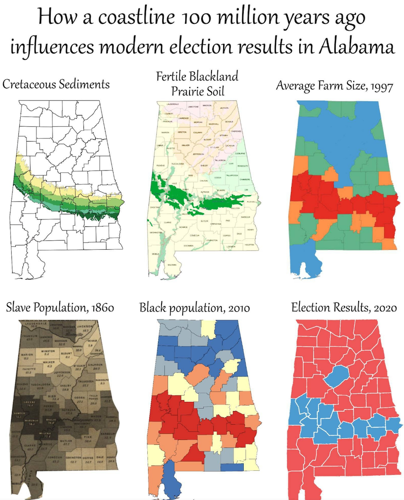
```

See Deep Sea News: [How presidential elections are impacted by a 100 million year old coastline](https://deepseanews.com/2012/06/how-presidential-elections-are-impacted-by-a-100-million-year-old-coastline/)

---

# `r fa("fas fa-dice-one", fill = "#fff")` Broad Interest

```{r, out.width = "720px", echo = FALSE, fig.align = "center"}
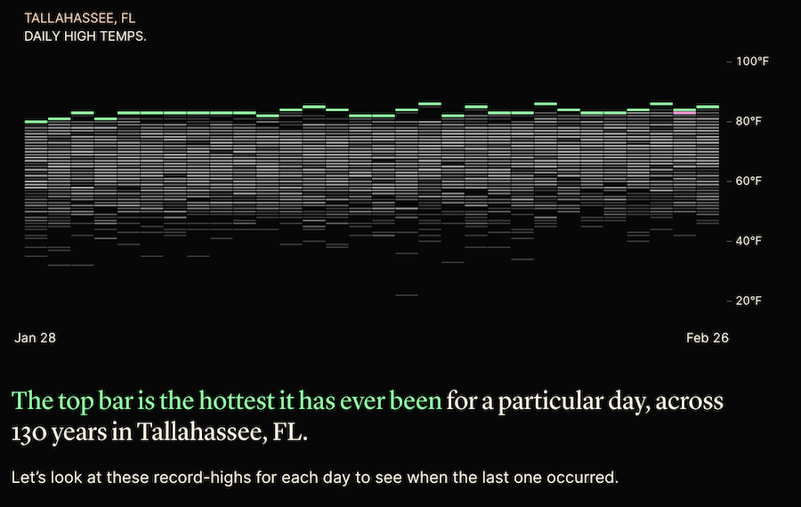
```

See https://pudding.cool/projects/heat-records/

---

# `r fa("fas fa-dice-one", fill = "#fff")` Broad Interest

```{r, out.width = "100%", echo = FALSE, fig.align = "center"}
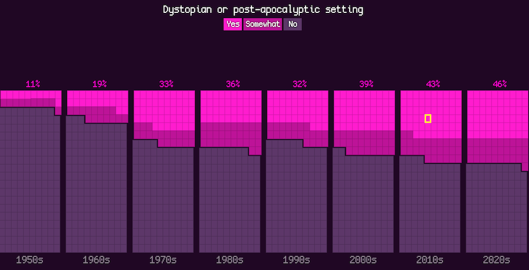
```

See https://pudding.cool/2024/07/scifi/


---

class: inverse, center, middle

# `r fa("fas fa-dice-two", fill = "#fff")` <br><br> Measure \#2 <br><br> `r fa("fab fa-uncharted", fill = "#fff")` Uncertainty

---

# `r fa("fas fa-dice-two", fill = "#fff")` Uncertainty

### Hurricane Cone of Uncertainty

```{r, out.width = "600px", echo = FALSE, fig.align = "center"}
include_graphics("img/5-ex2-1.jpg")
```

---

# `r fa("fas fa-dice-two", fill = "#fff")` Uncertainty

### Hurricane Spaghetti Models

```{r, out.width = "720px", echo = FALSE, fig.align = "center"}
include_graphics("img/5-ex2-2.jpg")
```

---

# `r fa("fas fa-dice-two", fill = "#fff")` Uncertainty

### Hurricane Wind Speed Probabilities

```{r, out.width = "600px", echo = FALSE, fig.align = "center"}
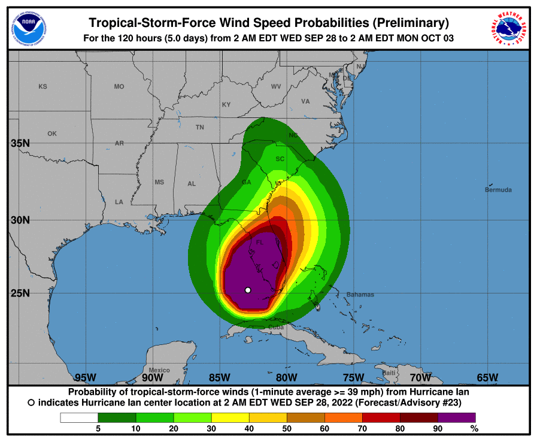
```

---

# `r fa("fas fa-dice-two", fill = "#fff")` Uncertainty

### Hurricane Rainfall Probabilities

```{r, out.width = "600px", echo = FALSE, fig.align = "center"}
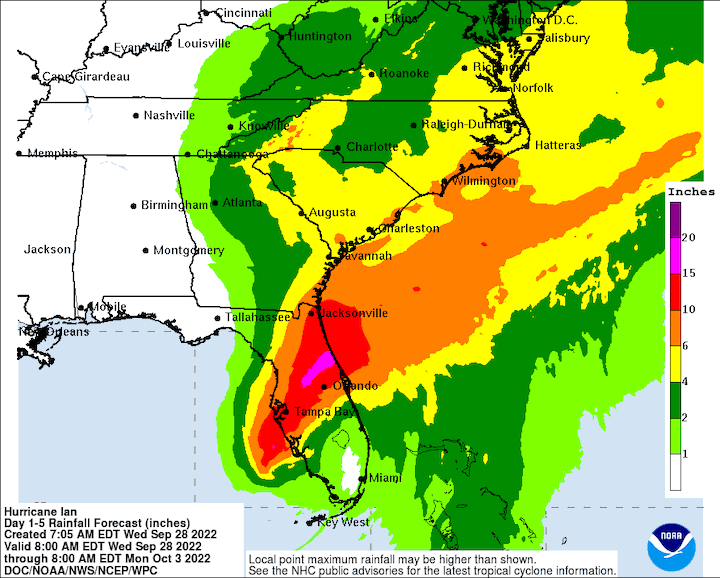
```

---

# `r fa("fas fa-dice-two", fill = "#fff")` Uncertainty

### Which plot is best?

```{r, out.width = "100%", echo = FALSE, fig.align = "center"}
include_graphics("img/5-ex2-5.png")
```

---

# `r fa("fas fa-dice-two", fill = "#fff")` Uncertainty

```{r, out.width = "100%", echo = FALSE, fig.align = "center"}
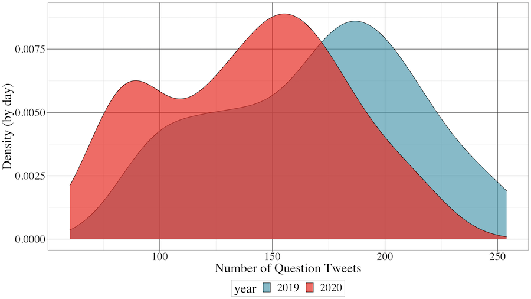
```


---

class: inverse, center, middle

# `r fa("fas fa-dice-three", fill = "#fff")` <br><br> Measure \#3 <br><br> `r fa("fas fa-calendar", fill = "#fff")` Time

---

# `r fa("fas fa-dice-three", fill = "#fff")` Time

```{r, out.width = "100%", echo = FALSE, fig.align = "center"}
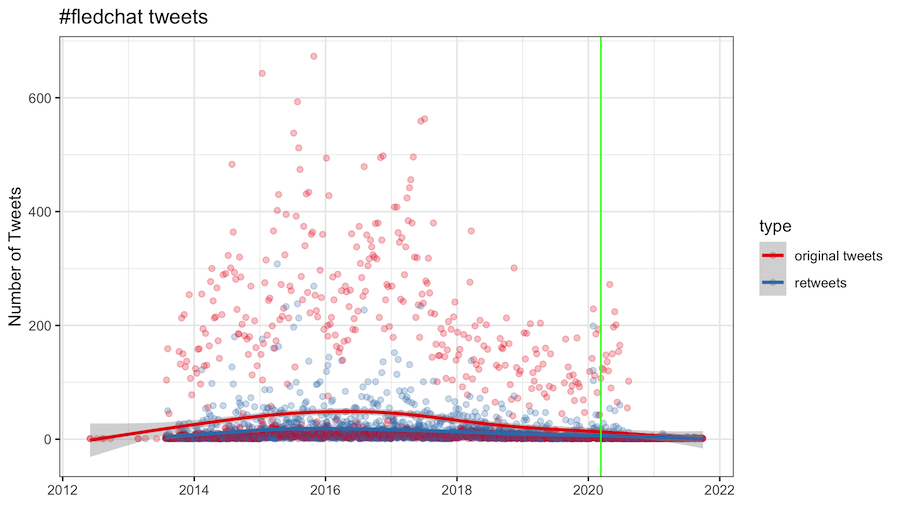
```

---

# `r fa("fas fa-dice-three", fill = "#fff")` Time

```{r, out.width = "100%", echo = FALSE, fig.align = "center"}
include_graphics("img/5-ex3-2.png")
```

---

# `r fa("fas fa-dice-three", fill = "#fff")` Time

```{r, out.width = "560px", echo = FALSE, fig.align = "center"}
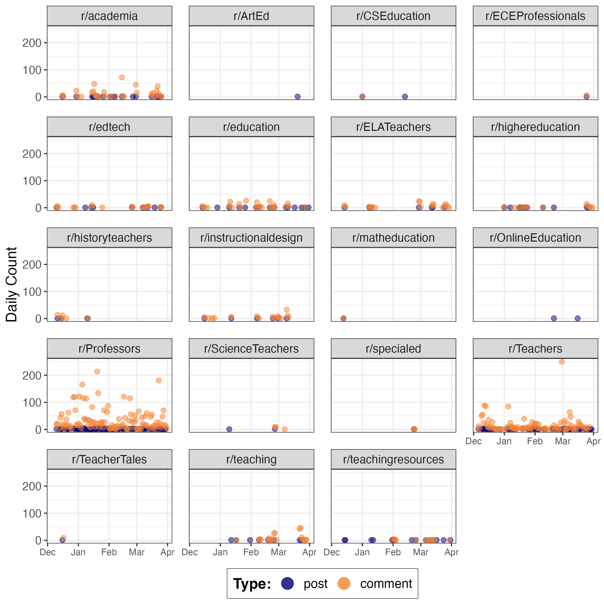
```


---

class: inverse, center, middle

# `r fa("fas fa-dice-four", fill = "#fff")` <br><br> Measure \#4 <br><br> `r fa("fas fa-share", fill = "#fff")` Networks

---

# `r fa("fas fa-dice-four", fill = "#fff")` Networks

```{r, out.width = "100%", echo = FALSE, fig.align = "center"}
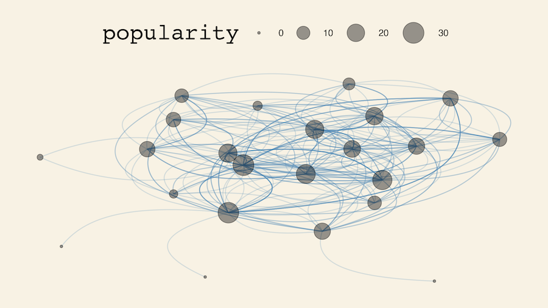
```

---

# `r fa("fas fa-dice-four", fill = "#fff")` Networks

```{r, out.width = "100%", echo = FALSE, fig.align = "center"}
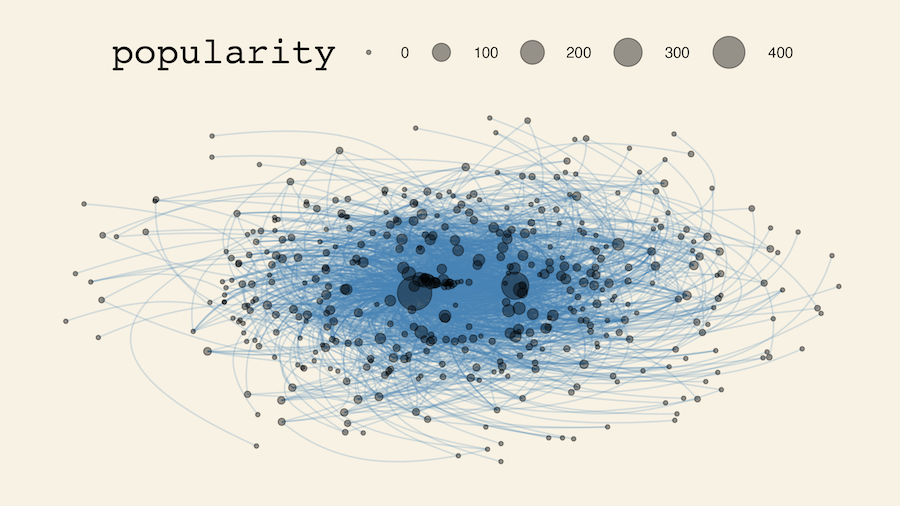
```


---

class: inverse, center, middle

# `r fa("fas fa-dice-five", fill = "#fff")` <br><br> Measure \#5 <br><br> `r fa("fas fa-arrows-left-right", fill = "#fff")` Relationships Between Variables

---

# `r fa("fas fa-dice-five", fill = "#fff")` Relationships

```{r, out.width = "540px", echo = FALSE, fig.align = "center"}
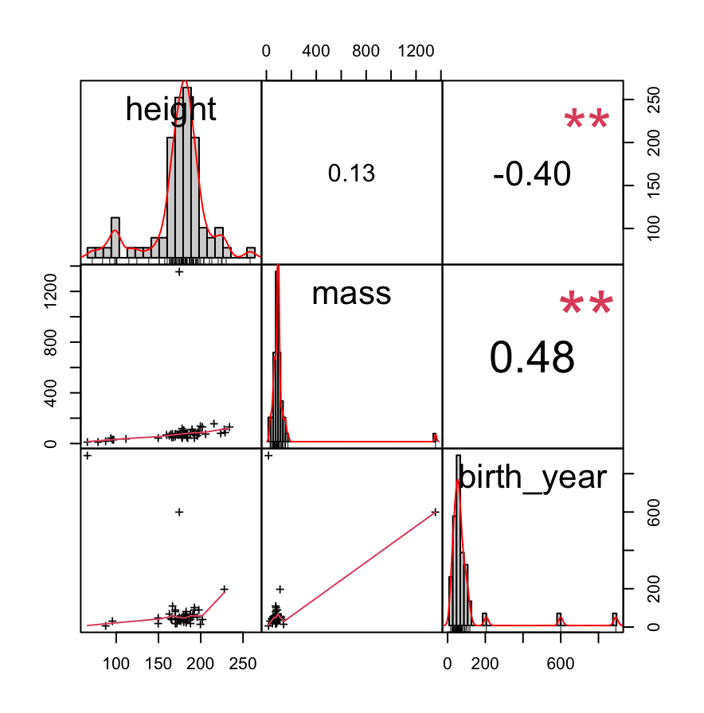
```

---

# `r fa("fas fa-dice-five", fill = "#fff")` Relationships

```{r, out.width = "540px", echo = FALSE, fig.align = "center"}
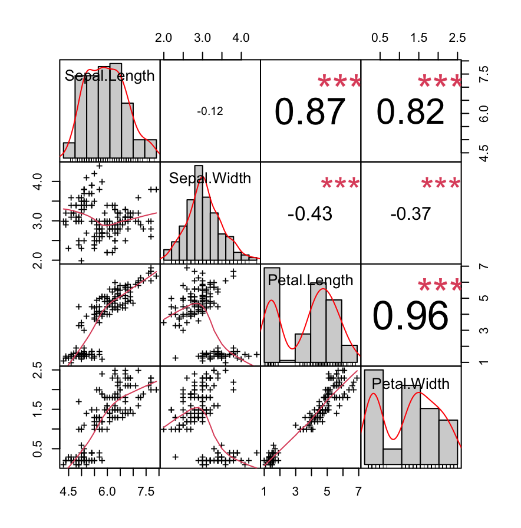
```

---

# `r fa("fas fa-dice-five", fill = "#fff")` Relationships

```{r, out.width = "540px", echo = FALSE, fig.align = "center"}
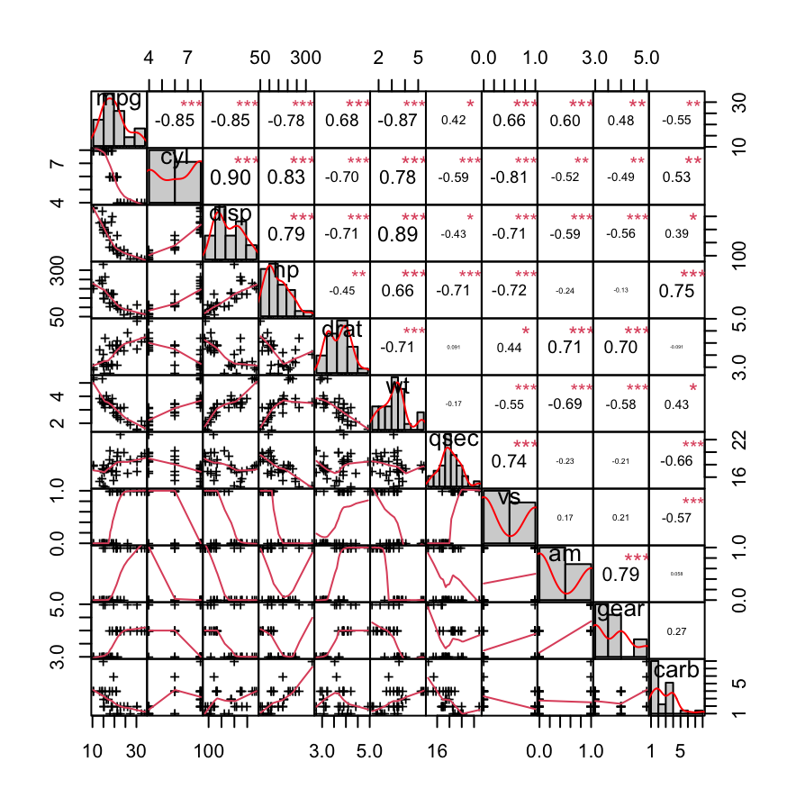
```


---

class: inverse, center, middle

# `r fa("fas fa-dice-six", fill = "#fff")` <br><br> Measure \#6 <br><br> `r fa("fas fa-comments", fill = "#fff")` Language

---

# `r fa("fas fa-dice-six", fill = "#fff")` Language

```{r, out.width = "720px", echo = FALSE, fig.align = "center"}
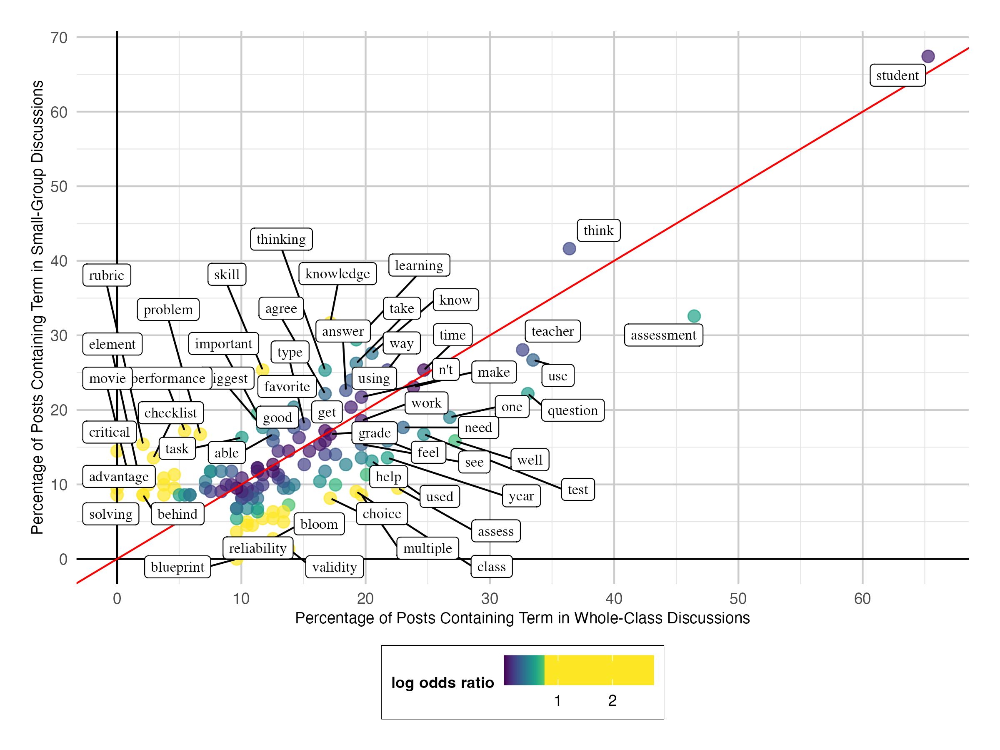
```

---

# `r fa("fas fa-dice-six", fill = "#fff")` Language

```{r, out.width = "540px", echo = FALSE, fig.align = "center"}
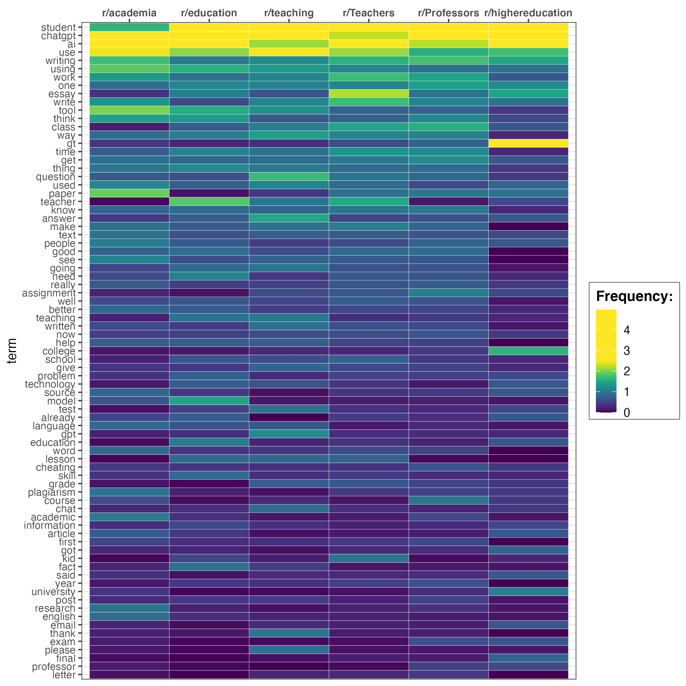
```

---

# `r fa("fas fa-dice-six", fill = "#fff")` Language

```{r, out.width = "100%", echo = FALSE, fig.align = "center"}
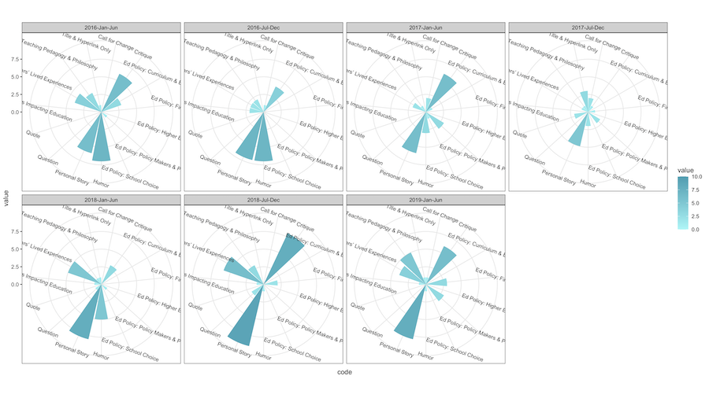
```


---

class: inverse, center, middle

# Collection of Analytics Tools

<div class="padlet-embed" style="border:1px solid rgba(0,0,0,0.1);border-radius:2px;box-sizing:border-box;overflow:hidden;position:relative;width:100%;background:#F4F4F4"><p style="padding:0;margin:0"><iframe src="https://fsu.padlet.org/embed/xxl6opndte57rmc5" frameborder="0" allow="camera;microphone;geolocation" style="width:100%;height:420px;display:block;padding:0;margin:0"></iframe></p><div style="padding:8px;text-align:right;margin:0;"><a href="https://padlet.com?ref=embed" style="padding:0;margin:0;border:none;display:block;line-height:1;height:16px" target="_blank"></a></div></div>

---

class: inverse, center, middle

# `r fa("fas fa-question", fill = "#fff")` <br> <br> What might we measure? <br> <br> How might we report?

---


class: inverse, center, middle

# `r fa("fas fa-binoculars", fill = "#fff")` <br><br> Looking ahead

---

# `r fa("fas fa-calendar-day", fill = "#fff")` Semester schedule

```{r, out.width = "720px", echo = FALSE, fig.align = "center"}
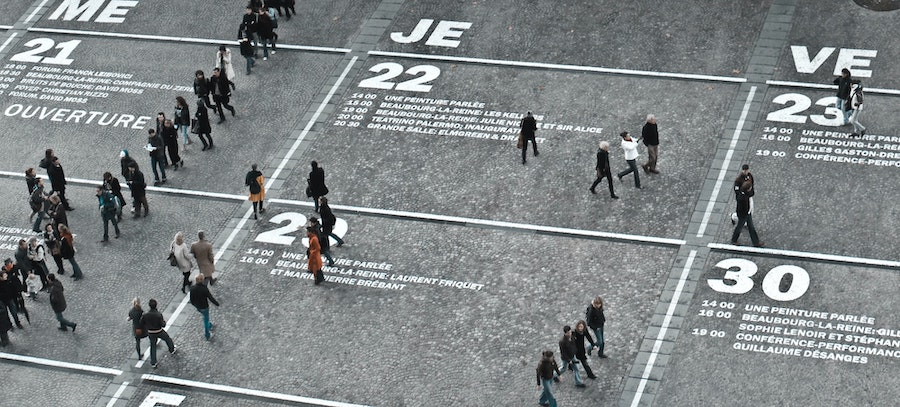
```

- **Module 1:** Introduction to Analytics
- **Module 2:** Performance Analytics
- **Module 3:** Learning Analytics
- **Module 4:** Web Analytics
- **Module 5: Data Visualization**
- **Module 6:** Ethics in Learning Analytics
- **Module 7:** Future of Analytics
- **Module 8:** Case Discussions

---

# `r fa("fas fa-calendar-day", fill = "#fff")` Module structure

```{r, out.width = "480px", echo = FALSE, fig.align = "center"}

```

- `r fa("video", fill = "#782F40")` Watch

- `r fa("compass", fill = "#782F40")` Explore

- `r fa("book-open", fill = "#782F40")` Read

- `r fa("comments", fill = "#782F40")` Discuss

- `r fa("fas fa-keyboard", fill = "#782F40")` Create

---

# `r fa("fas fa-calendar-day", fill = "#fff")` Upcoming Assignments

```{r, out.width = "300px", echo = FALSE, fig.align = "center"}
include_graphics("img/build.jpg")
```

### Analytics Practice (200 points) - **due end of Module 5**

--

- "Identify a data source, access/collect the data, analyze it, and tell its story in a **1000- to 1500-word** report **with graphics**."

--

- "What real-world problem or opportunity for improvement (however big or small) might be addressed using analytics."

--

- "The **data collection process and analytic tool** you used. Succinctly discuss how your data were identified, collected, processed, and analyzed."

--

- "**Graphics** are of high importance and you should include graphics (e.g. charts) to show **trends** wherever possible. Even better if you compare the relationships between variables with scatterplots and **correlations**."

---

# `r fa("fas fa-calendar-day", fill = "#fff")` Upcoming Assignments

```{r, out.width = "300px", echo = FALSE, fig.align = "center"}
include_graphics("img/build.jpg")
```

### Working As a Team

--

[Sample CRediT author statement](https://www.elsevier.com/researcher/author/policies-and-guidelines/credit-author-statement)

--

<hr>

- **Sun Qi:** Supervision, Conceptualization, Methodology, Writing- Reviewing and Editing.
- **Priya Singh:** Data Curation, Software, Data Analysis, Writing- Original draft preparation. 
- **Jan Jansen:** Software, Validation, Visualization, Investigation, Writing- Reviewing and Editing.


---

class: inverse, center, middle

# `r fa("fas fa-question", fill = "#fff")` <br><br> Questions

<hr>

**What questions can I answer for you now?**

**How can I support you this week?**

<hr>

`r fa("envelope", fill = "#fff")` [bret.staudtwillet@fsu.edu](mailto:bret.staudtwillet@fsu.edu) | `r fa("globe", fill = "#fff")` [bretsw.com](https://bretsw.com) | `r fa("fab fa-github", fill = "#fff")` [GitHub](https://github.com/bretsw/)

---

class: inverse, center, middle

# Learn to Code

```{r, out.width = "320px", echo = FALSE, fig.align = "center"}
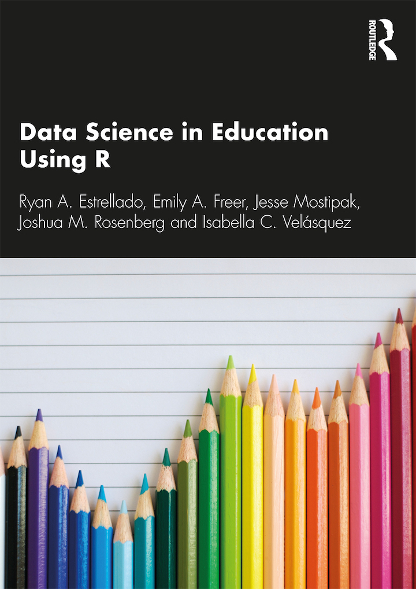
```

**https://datascienceineducation.com/**

---

class: inverse, center, middle

# `r fa("fas fa-otter", fill = "#fff")` <br><br> Play in the <br> [Analytics Sandbox](https://bretsw.com/sandbox)

`r fa("fab fa-github", fill = "#fff")` [GitHub repository for code and data](https://github.com/bretsw/sandbox)

`r fa("fas fa-cubes-stacked", fill = "#fff")` [Datasets for practice](https://bretsw.com/post/datasets/)
